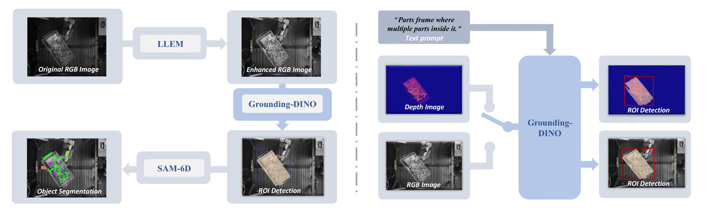

# BioDet: Boosting Industrial Object Detection with Image Preprocessing Strategies



## ⚙️ Requirements
- Ubuntu 20.04
- Python 3.9
- Pytorch 2.3.0
- CUDA 11.8
- 1 * NVIDIA RTX 4090

## 🔨 Installation

- ### Create Environment

```bash
conda env create -f environment.yaml
conda activate BioDet
```

## 🗂️ Download dataset and models

### Download basic models in SAM6D
``` bash
cd Instance_Segmentation_Model
python download_sam.py
python download_fastsam.py
python download_dinov2.py
```
### Download additional models in BioDet
[](https://github.com/IDEA-Research/GroundingDINO/releases/download/v0.1.0-alpha/groundingdino_swint_ogc.pth)

[](https://drive.google.com/file/d/1i2SjVkvmTgZc3HnLKrt7mjbge9LINVin/view?usp=sharing)

[](https://drive.google.com/file/d/1gx1gswYfv3sUXXJAXmP_XtRa_OY7h94l/view?usp=sharing)

The organization of the checkpoints should be as follows:
``` bash
SAM-6D
└── Instance_Segmentation_Model
   ├── checkpoints
        ├── dinov2
        ├── FastSAM
        ├── gdino
        ├── HVI
        ├── mobilesam
        └── segment-anything
```

### Download the datasets
- You can download the Datasets (IPD/XYZ-IBD) from [BOP Benchmark](https://bop.felk.cvut.cz/datasets/).

- We provide the rendered templates of IPD for trying, you can download from [this link](https://drive.google.com/file/d/17D8k-Af3zssLZ3NflObeA-Wfih4jj5He/view?usp=sharing)

- The organization of the datasets should be as follows:
``` bash
SAM-6D
└── Data
    ├── BOP
        ├── ipd
            ├── test
            ├── models
            ├── test_targets_bop24.json
        ├── xyzibd
            ├── test
            ├── models
            ├── test_targets_bop24.json
    └── BOP-Templates
        ├── ipd
        ├── xyzibd

# Feel free to change the data path under "SAM-6D/Instance_Segmentation_Model/preprocess/config.yaml"
```

## 🎯 Inference and evaluation
### Evaluate 2D Detection performance
```python
# inference IPD with fastsam
python SAM-6D/Instance_Segmentation_Model/inference_ipd.py \
  --dataset_name ipd \
  --cfg SAM-6D/Instance_Segmentation_Model/preprocess/config.yaml \
  --sam_type ISM_fastsam

# inference IPD with sam
python SAM-6D/Instance_Segmentation_Model/inference_ipd.py \
  --dataset_name ipd \
  --cfg SAM-6D/Instance_Segmentation_Model/preprocess/config.yaml \
  --sam_type ISM_sam

# inference XYZ-IBD with fastsam
python SAM-6D/Instance_Segmentation_Model/inference_xyzibd.py \
  --dataset_name ipd \
  --cfg SAM-6D/Instance_Segmentation_Model/preprocess/config.yaml \
  --sam_type ISM_fastsam

# inference XYZ-IBD with sam
python SAM-6D/Instance_Segmentation_Model/inference_xyzibd.py \
  --dataset_name ipd \
  --cfg SAM-6D/Instance_Segmentation_Model/preprocess/config.yaml \
  --sam_type ISM_sam
```
### Convert the results to BOP format
```python
python convert_bop_fromat.py --dataset_name ipd --segmentation_model fastsam

python convert_bop_fromat.py --dataset_name ipd --segmentation_model sam

python convert_bop_fromat.py --dataset_name xyzibd --segmentation_model fastsam

python convert_bop_fromat.py --dataset_name xyzibd --segmentation_model sam
```